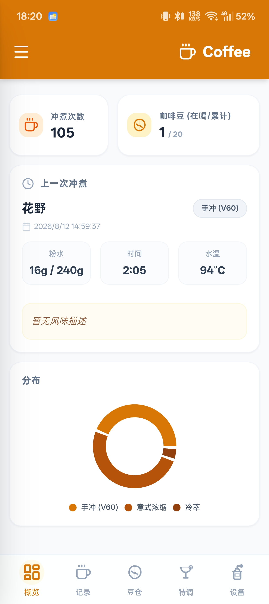
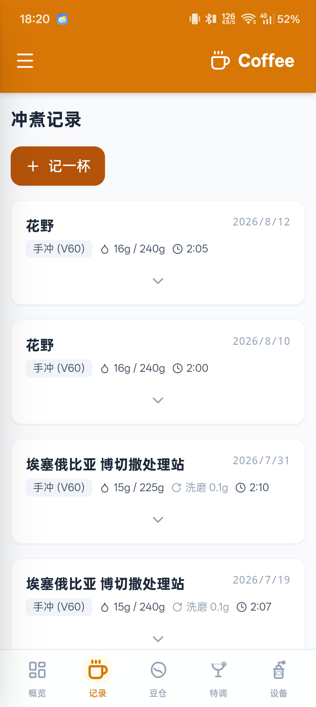
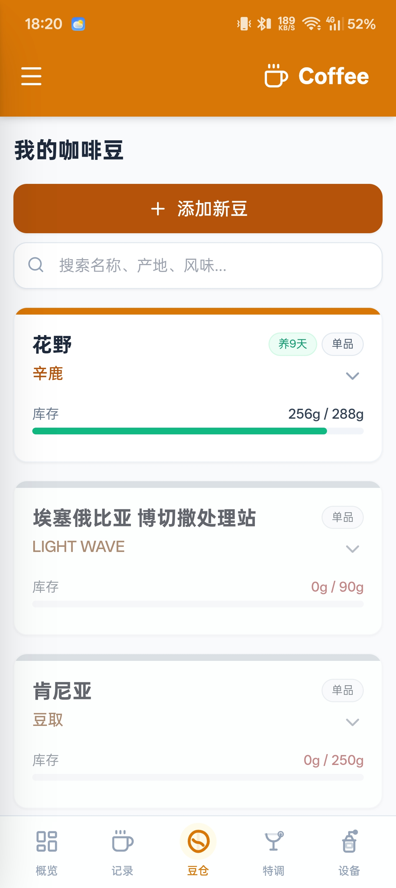
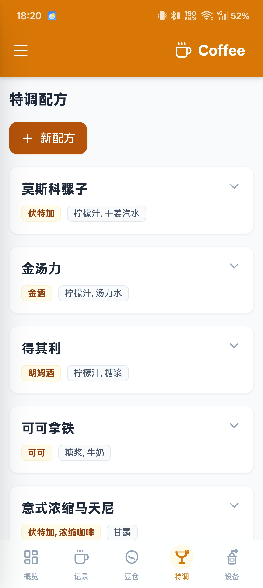

# Coffee ☕

一款为咖啡爱好者打造的冲煮记录应用：管理你的咖啡豆库存、记录每一次冲煮参数、复盘风味变化，让每一杯咖啡都有迹可循。

 

## ✨ 功能

- **📊 概览仪表盘** — 冲煮统计图表、近期记录、库存概览与 AI 冲煮分析
- **☕ 冲煮记录** — 支持手冲 (V60)、意式浓缩、冷萃、爱乐压、法压壶、摩卡壶；记录研磨度、粉水比、水温、时间等完整参数，可关联器材与咖啡豆
- **🫘 豆仓管理** — 单品/拼配豆信息、烘焙度、豆种、风味描述、烘焙/购买日期，实时追踪库存余量，拼配豆可按比例拆分记录
- **🍸 特调配方** — 记录以咖啡为基底的创意饮品配方（原料、用量、步骤）
- **🔧 设备管理** — 磨豆机、滤杯、电子秤等器材档案
- **💾 数据归档** — 一键备份/恢复全部数据（本地保存 / 分享导出），纯 JSON 格式无锁定
- **📶 离线优先** — Service Worker 本地缓存，断网可用

## 📱 界面截图

| 概览仪表盘 | 冲煮记录 |
|:---:|:---:|
|  |  |

| 豆仓管理 | 特调配方 |
|:---:|:---:|
|  |  |

## 🛠️ 技术栈

- **前端**：React 19 + TypeScript + Vite
- **UI**：Tailwind CSS + lucide-react + recharts
- **跨端**：Capacitor 7（Android）/ PWA（Service Worker）
- **AI**：Google Gemini（冲煮数据分析）

## 🔨 构建

```bash
npm install

# Web / PWA
npm run build

# Android
npm run build
npx cap sync android
cd android && .\gradlew.bat assembleDebug
# 产物: android/app/build/outputs/apk/debug/app-debug.apk
```

## 📄 许可

个人学习与自用项目，欢迎参考交流。
